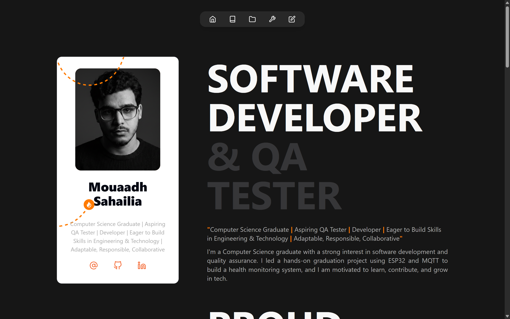
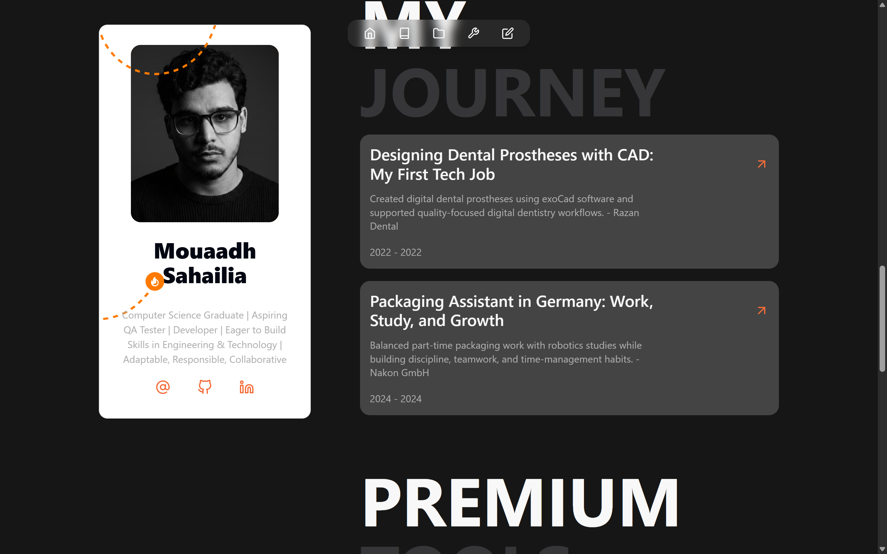
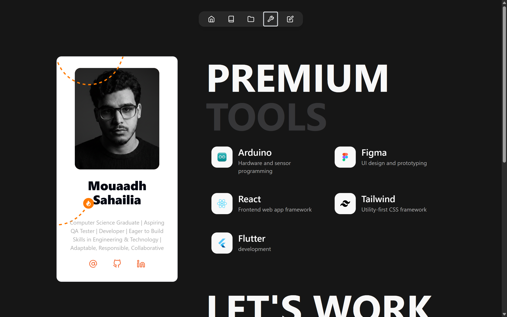
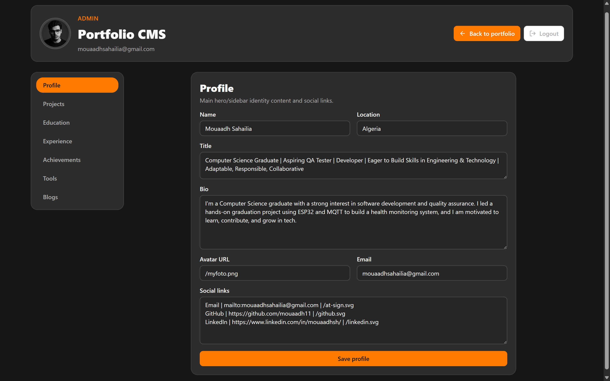
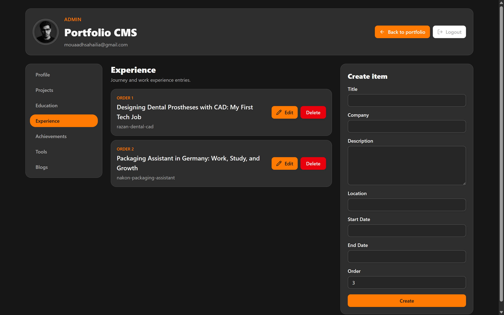

# MouaadhSh Portfolio

A personal portfolio and lightweight CMS for managing profile content, projects, education, experience, achievements, tools, and blog posts.

Built with React, TypeScript, Vite, Tailwind CSS, Firebase, and Resend.

## Screenshots

### Portfolio







### Admin CMS





## Features

- Dark responsive portfolio layout
- Sticky profile card with avatar and social links
- Sections for projects, education, experience, achievements, tools, contact, and blogs
- Firebase-powered admin dashboard
- Create, edit, and delete portfolio content from the CMS
- Contact form powered by Resend

## Requirements

- Node.js 20 or newer
- npm
- Firebase project for Auth and Firestore
- Resend API key for contact emails

## Run Locally

```bash
npm install
npm run dev
```

Vite will print the local URL, usually `http://localhost:5173/`.

## Environment Variables

Create a `.env` file for Firebase:

```env
VITE_FIREBASE_API_KEY=
VITE_FIREBASE_AUTH_DOMAIN=
VITE_FIREBASE_PROJECT_ID=
VITE_FIREBASE_STORAGE_BUCKET=
VITE_FIREBASE_MESSAGING_SENDER_ID=
VITE_FIREBASE_APP_ID=
```

For the contact API, configure these deployment variables:

```env
RESEND_API_KEY=
CONTACT_TO_EMAIL=
CONTACT_FROM_EMAIL=
```

## Scripts

```bash
npm run dev      # start the development server
npm run build    # type-check and create a production build
npm run preview  # preview the production build locally
npm run lint     # run ESLint
```
